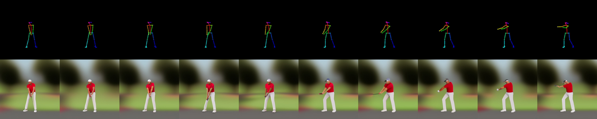
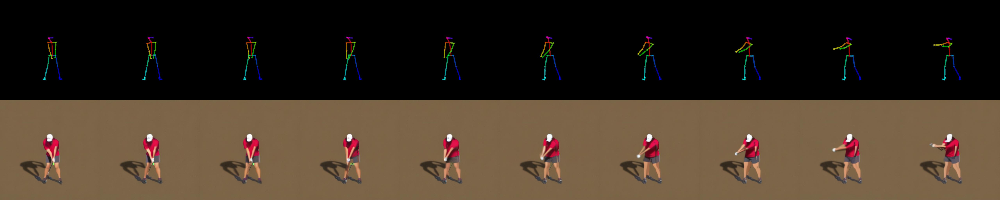

# Controlled video generation without finetuning





Generating spatially and temporally consistent
action-specific videos, such as golf swing sequences,
using pre-trained diffusion models without domain-
specific fine-tuning is a significant challenge in video
synthesis. This project explores novel methodologies
for zero-shot video generation by leveraging latent
space manipulations in Stable Diffusion pipelines.

we explored innovative strategies, including:
- Noise manipulation: Demonstrating the importance of noise progression and fixing noise seeds to enhance temporal coherence.
- Latent space exploration: Investigating the limitations of naive operations such as latent blending and introducing effective alternatives like intermediate latent copying.
- Latent differences: Identifying the potential of latent differences as a dynamic feature to guide temporal transitions and semantic shifts.
- Leveraging original video latents: Integrating pre-existing motion and style cues to refine generated outputs.
- Novel action-specific pipeline: Proposing a framework inspired by video compression, where aligned latent differences capture generic semantic shifts for scalable video generation.


## Guidelines

1. Get the controlnet + sd 2.1 checkpointLook from https://huggingface.co/thibaud/controlnet-sd21.
2. Convert the `.ckpt` into diffuser directory.
```
python  convert_original_controlnet_to_diffusers.py --checkpoint_path control_v11p_sd21_openpose/cont
rol_v11p_sd21_openpose.ckpt  --original_config_file ./cldm_v21.yaml --image_size 512 --device cuda --dump_path ./new_controlnet-pose-sd21-diffusers
```
3. After conversion, you shall use it with package `diffuser`
```
controlnet = ControlNetModel.from_pretrained(
    "/home/ubuntu/diffusion/new_controlnet-pose-sd21-diffusers",
    torch_dtype=torch.float32,
    local_files_only=True,
)
pipe = StableDiffusionControlNetPipeline.from_pretrained(
    "stabilityai/stable-diffusion-2-1",
    controlnet=controlnet, 
    torch_dtype=torch.float32,
    #local_files_only=True,
)
```
4. Run `python sdvideo.py` after checking all arguments to control

Memo:
https://github.com/huggingface/diffusers/issues/2581 

